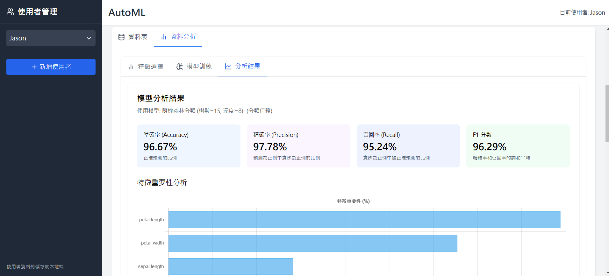

# AutoML App

一個自動化機器學習數據分析網頁應用。




## 功能特點

- 可新增刪除使用者
- 可顯示上傳之Excel/csv文件
- 可根據Excel/csv數據內容推薦要進行分類或是回歸分析
- 可比較多種ML模型並顯示最佳之模型分析結果
- 可視化分析結果,如:特徵重要度分析, 混淆矩陣等

## 技術

- Frontend: 
  - HTML5
  - JavaScript
  - Tailwind CSS

## 快速開始

1. clone rep：
   ```bash
   git clone https://github.com/jason211346/ML_Analyzer.git
   cd ML_Analyzer
   ```

2. 安裝依賴：
   ```bash
   - 安裝 Node.js
   ```
   ```bash
   npm install
   ```

3. 運行應用：
   ```bash
   npm run dev
   ```

4. 打開瀏覽器訪問：
   ```
   http://localhost:3000
   ```

6. 建立使用者,上傳文件後開始使用


